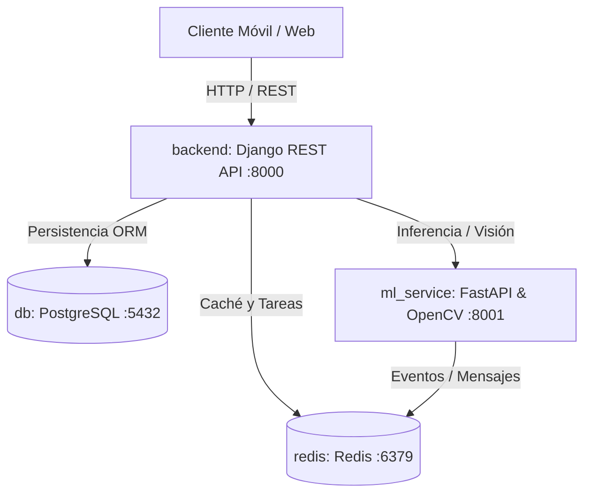

# BiomecanicSport

Plataforma de microservicios para el análisis biomecánico, entrenamiento basado en velocidad (VBT) y monitoreo del rendimiento físico en atletas de alto rendimiento mediante visión por computador y telemetría.

---

## Arquitectura del Sistema

El sistema opera bajo una arquitectura de microservicios contenerizada con Docker:



### Servicios

| Servicio | Tecnología | Puerto | Descripción |
| :--- | :--- | :--- | :--- |
| **backend** | Django 5, DRF, Python 3.12 | `8000` | API principal, autenticación, gestión de atletas, lógica de negocio y persistencia. |
| **ml_service** | FastAPI, OpenCV, NumPy, Python 3.12 | `8001` | Procesamiento de video, estimación de puntos articulares y cálculos cinemáticos. |
| **db** | PostgreSQL 16 Alpine | `5432` | Base de datos relacional (`BiomecanicSport`). |
| **redis** | Redis 7 Alpine | `6379` | Gestor de memoria en caché y cola de tareas asíncronas. |

---

## Estructura del Proyecto

```text
BiomecanicSport/
├── .env.example            # Plantilla de variables de entorno
├── .env                    # Configuración de entorno activa
├── docker-compose.yml       # Orquestación de servicios
├── backend/                # API REST (Django)
│   ├── Dockerfile
│   ├── requirements.txt
│   ├── manage.py
│   └── core/               # Configuración del proyecto
│       ├── settings.py
│       ├── urls.py
│       ├── wsgi.py
│       └── asgi.py
├── ml_service/             # Microservicio de Visión y ML (FastAPI)
│   ├── Dockerfile
│   ├── requirements.txt
│   └── app/
│       ├── __init__.py
│       └── main.py
├── frontend/               # Aplicación cliente
└── V1/                     # Código previo de escritorio (Flet)
```

---

## Despliegue Local

### 1. Variables de Entorno
Generar el archivo `.env` a partir de la plantilla:
```bash
cp .env.example .env
```

Parámetros por defecto en `.env`:
* **Base de datos:** `BiomecanicSport`
* **Usuario:** `biomecanic_user`
* **Contraseña:** `biomecanic_secret_password`
* **Host DB:** `db`
* **Host Redis:** `redis`

### 2. Iniciar Servicios
Construir las imágenes y levantar los 4 contenedores:
```bash
docker compose up -d --build
```

Verificar estado de los contenedores:
```bash
docker compose ps
```

### 3. Migraciones y Administrador de Django
Aplicar las migraciones a PostgreSQL:
```bash
docker compose exec backend python manage.py migrate
```

Crear superusuario:
```bash
docker compose exec backend python manage.py createsuperuser
```

---

## Endpoints de Verificación

* **Django Backend Health Check:** `http://localhost:8000/api/health/`
* **Django Admin:** `http://localhost:8000/admin/`
* **ML Service Estado:** `http://localhost:8001/`
* **ML Service Swagger UI:** `http://localhost:8001/docs`
* **ML Service Redoc:** `http://localhost:8001/redoc`

---

## Comandos Operativos

* **Ver registros de los servicios:**
  ```bash
  docker compose logs -f
  docker compose logs -f backend
  docker compose logs -f ml_service
  ```

* **Acceso a terminal interactiva:**
  ```bash
  # Backend Django
  docker compose exec backend bash

  # Base de datos PostgreSQL
  docker compose exec db psql -U biomecanic_user -d BiomecanicSport
  ```

* **Detener los servicios:**
  ```bash
  docker compose down
  ```
