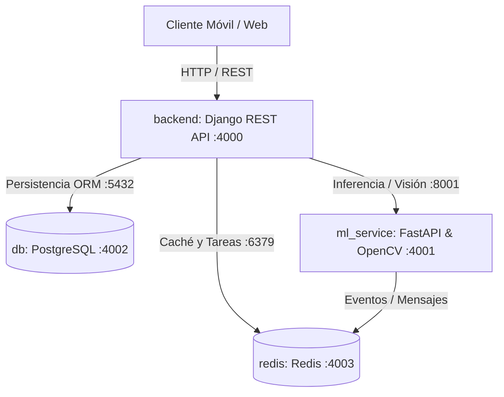

# BiomecanicSport

Plataforma de microservicios para el análisis biomecánico, entrenamiento basado en velocidad (VBT) y monitoreo del rendimiento físico en atletas de alto rendimiento mediante visión por computador y telemetría.

---

## Arquitectura del Sistema

El sistema opera bajo una arquitectura de microservicios contenerizada con Docker:



### Servicios y Puertos Asignados

| Servicio | Tecnología | Puerto en Host | Puerto Contenedor | Descripción |
| :--- | :--- | :--- | :--- | :--- |
| **backend** | Django 5, DRF, Python 3.12 | `4000` | `8000` | API principal, gestión de atletas, capa de servicios (Service Layer) y persistencia. |
| **ml_service** | FastAPI, OpenCV, NumPy, Python 3.12 | `4001` | `8001` | Arquitectura Hexagonal para cinemática, estimación articular y cálculo de ángulos. |
| **db** | PostgreSQL 16 Alpine | `4002` | `5432` | Base de datos relacional (`BiomecanicSport`). |
| **redis** | Redis 7 Alpine | `4003` | `6379` | Gestor de memoria en caché y cola de tareas asíncronas. |

---

## Estructura del Proyecto

```text
BiomecanicSport/
├── .env.example            # Plantilla de variables de entorno
├── .env                    # Configuración de entorno activa (puertos 4000-4003)
├── docker-compose.yml       # Orquestación de servicios
│
├── backend/                # API REST (Django - Patrón MVC + Service Layer)
│   ├── Dockerfile
│   ├── requirements.txt
│   ├── manage.py
│   ├── core/               # Configuración del proyecto (settings, urls, wsgi, asgi)
│   └── core_app/           # Aplicación de gestión deportiva
│       ├── apps.py
│       ├── models.py       # Entidad Atleta
│       ├── serializers.py  # DTO / Serializador DRF con cálculo de IMC
│       ├── services.py     # AtletaService (Reglas de negocio aisladas)
│       ├── views.py        # Controladores REST
│       └── urls.py         # Rutas de la API de atletas
│
├── ml_service/             # Microservicio de Visión y ML (Arquitectura Hexagonal)
│   ├── Dockerfile
│   ├── requirements.txt
│   ├── main.py             # Punto de entrada ASGI
│   ├── domain/             # Lógica matemática pura y entidades sin dependencias web
│   │   └── biomechanics.py # CalculadorBiomecanico y PuntoArticular
│   ├── application/        # Casos de uso de la aplicación
│   │   └── video_use_case.py # ProcesarVideoMovimientoUseCase
│   └── infrastructure/     # Adaptadores de entrada y salida
│       ├── main.py         # Configuración de FastAPI y CORS
│       └── api/
│           └── routers.py  # Endpoints REST y esquemas Pydantic
│
├── frontend/               # Aplicación cliente
└── V1/                     # Código previo de escritorio (Flet)
```

---

## Despliegue Local

### 1. Variables de Entorno
Generar el archivo `.env` a partir de la plantilla:
```bash
cp .env.example .env
```

Parámetros por defecto en `.env`:
* **Puerto Backend:** `4000`
* **Puerto ML Service:** `4001`
* **Puerto PostgreSQL:** `4002`
* **Puerto Redis:** `4003`
* **Base de datos:** `BiomecanicSport`
* **Usuario:** `biomecanic_user`
* **Contraseña:** `biomecanic_secret_password`

### 2. Iniciar Servicios
Construir las imágenes y levantar los contenedores:
```bash
docker compose up -d --build
```

Verificar estado de los contenedores:
```bash
docker compose ps
```

### 3. Migraciones y Administrador de Django
Aplicar las migraciones a PostgreSQL:
```bash
docker compose exec backend python manage.py makemigrations
docker compose exec backend python manage.py migrate
```

Crear superusuario:
```bash
docker compose exec backend python manage.py createsuperuser
```

---

## Endpoints de Verificación

* **Django Backend Health Check:** `http://localhost:4000/api/health/`
* **API de Atletas (Listar / Registrar):** `http://localhost:4000/api/atletas/`
* **Django Admin:** `http://localhost:4000/admin/`
* **ML Service Estado:** `http://localhost:4001/`
* **ML Service Simulación Biomecánica:** `http://localhost:4001/analisis/simulacion`
* **ML Service Swagger UI:** `http://localhost:4001/docs`
* **ML Service Redoc:** `http://localhost:4001/redoc`

---

## Comandos Operativos

* **Ver registros de los servicios:**
  ```bash
  docker compose logs -f
  docker compose logs -f backend
  docker compose logs -f ml_service
  ```

* **Acceso a terminal interactiva:**
  ```bash
  # Backend Django
  docker compose exec backend bash

  # Base de datos PostgreSQL
  docker compose exec db psql -U biomecanic_user -d BiomecanicSport -p 5432
  ```

* **Detener los servicios:**
  ```bash
  docker compose down
  ```
